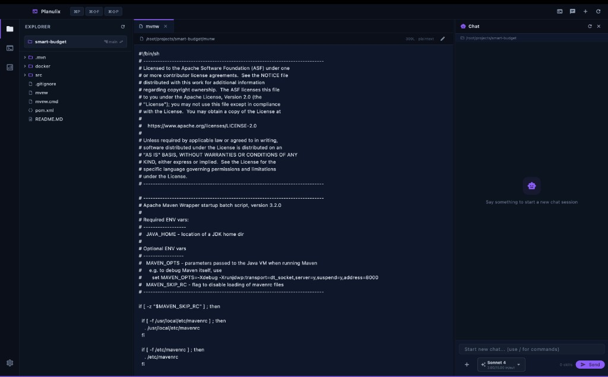
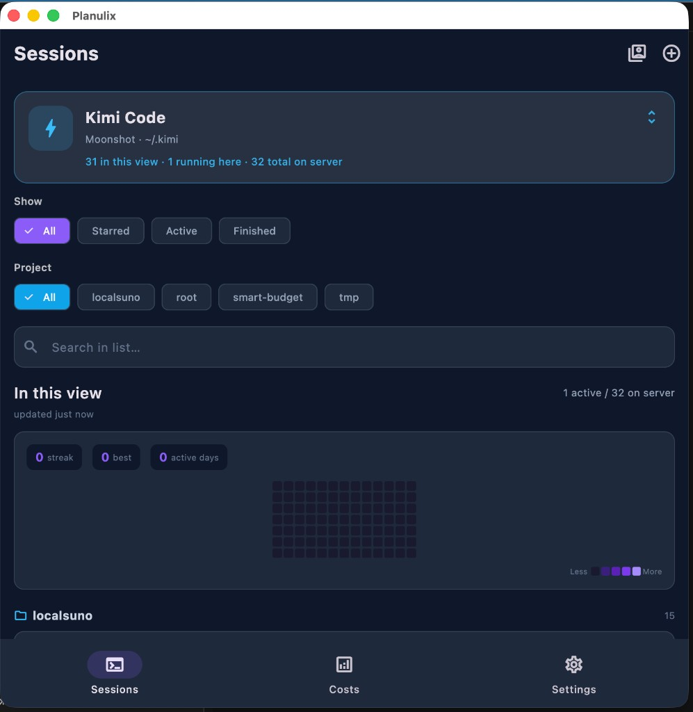
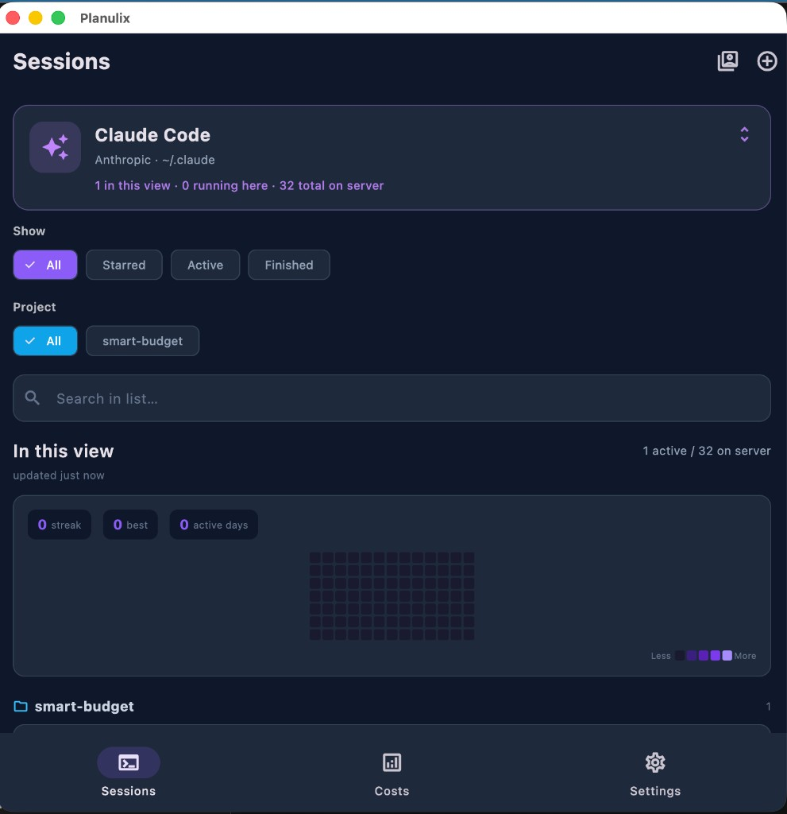
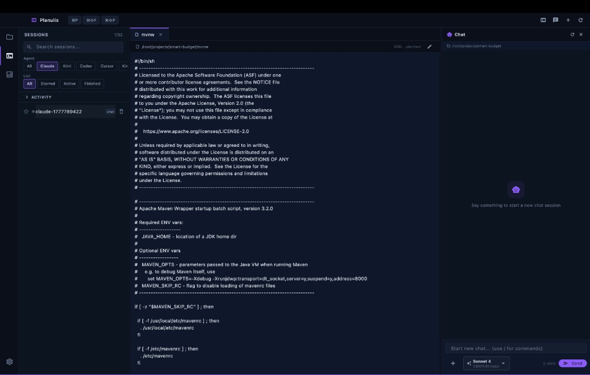
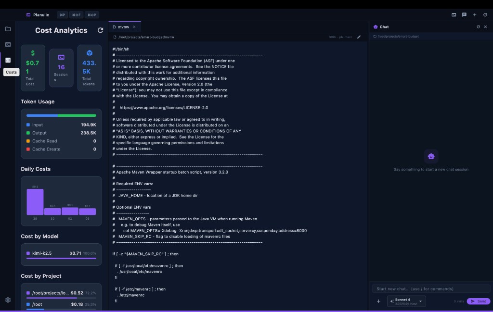
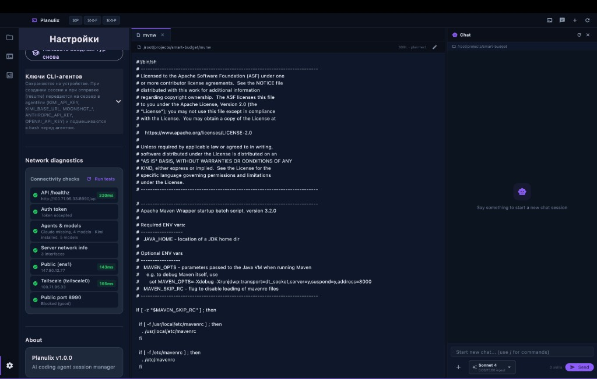
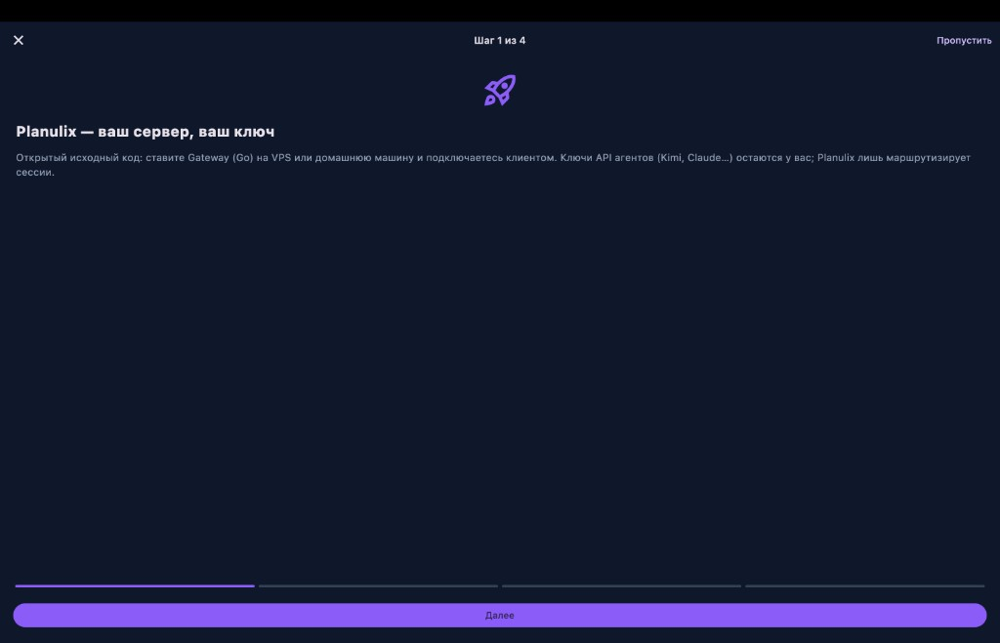
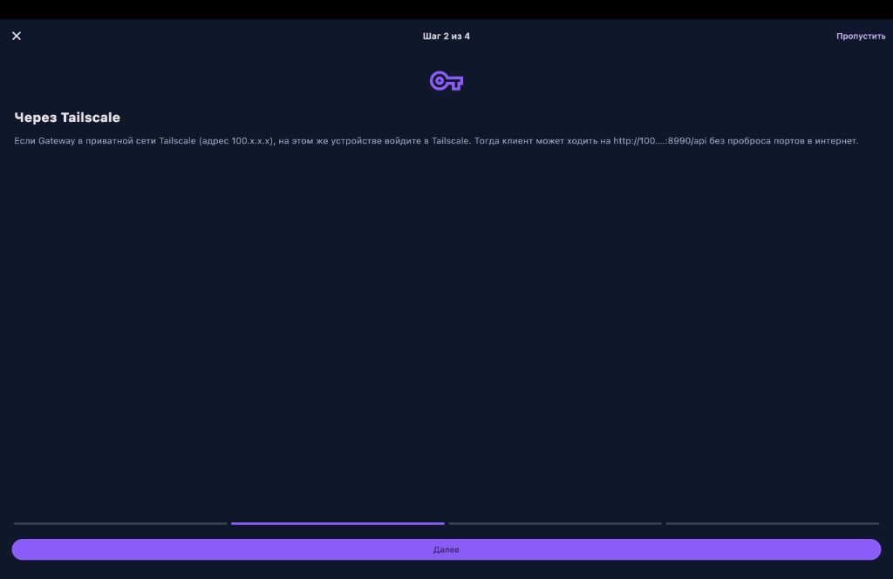
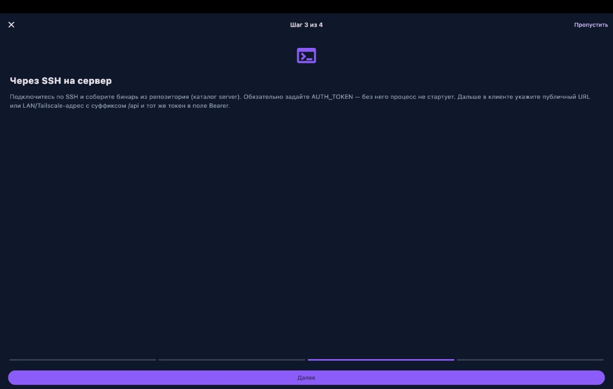
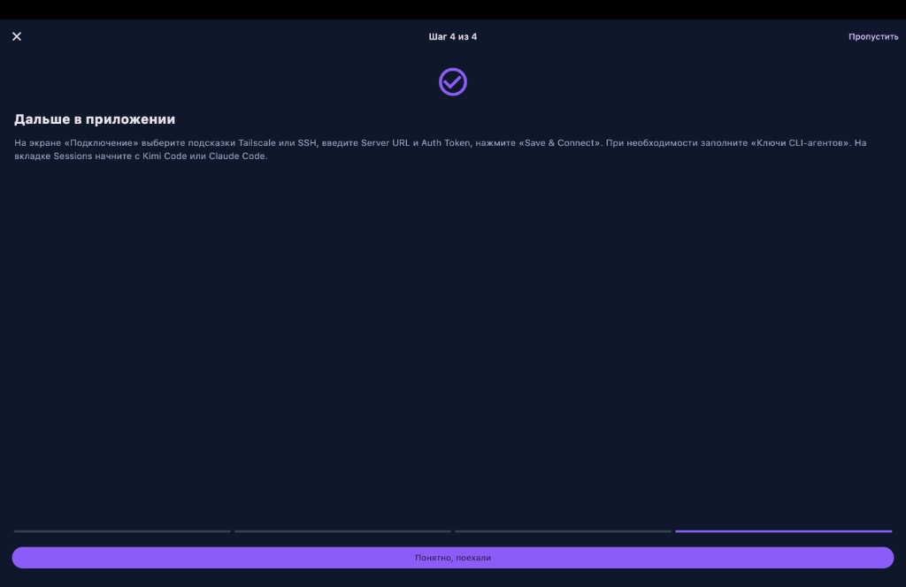

# Planulix

**Planulix** — клиент и **self-hosted Gateway (Go)** для управления сессиями **Kimi Code**, **Claude Code** и других CLI-агентов: список сессий, чат, редактор файлов на сервере, учёт токенов и стоимости.

*Planulix — session manager and remote workspace for Kimi & Claude coding agents (mobile, desktop, web).*



### Поддержать автора

Если Planulix оказался полезным — можно [**купить кофе автору на Boosty**](https://boosty.to/planulix):

[](https://boosty.to/planulix)

---

## Что вы получаете

- **Ваш сервер, ваш токен API** — ключи агентов хранятся у вас в приложении и передаются на Gateway в `agentEnv`; трафик идёт на ваш VPS или домашнюю машину.
- **Единый список сессий** — фильтры по статусу (все / избранное / активные / завершённые), по проекту, поиск, переключение области агента (Kimi / Claude / …).
- **Подсчёт сессий** — в карточке агента и в сводке: сколько сессий в текущем фильтре, сколько активно, сколько всего на сервере; на панели сессий в IDE — счётчик вида `SESSIONS 1/32`.
- **Аналитика расходов** — суммарная стоимость, токены (вход / выход), график по дням, разбивка по моделям и проектам.
- **Режим редактора** — открытие файлов дерева проекта, подсветка синтаксиса, путь к файлу на сервере; рядом чат с выбранной моделью и slash-командами (`/skills`).
- **Вводный тур** — четыре шага при первом запуске: архитектура, Tailscale, сборка сервера по SSH, что делать дальше в приложении. Повторить тур можно в **Настройках**.
- **Диагностика сети** — проверка `/healthz`, токена, установленных агентов, интерфейсов сервера (публичный IP, Tailscale), доступности порта Gateway.

---

## Скриншоты

### Мобильный вид: дашборд сессий (Kimi Code)

Портретный клиент: карточка **Kimi Code** (Moonshot, рабочий каталог), фильтры **Show** / **Project**, поиск, блок **In this view** с полосой активности (heatmap) и счётчиками **в этом виде · запущено здесь · всего на сервере**, нижняя навигация **Sessions / Costs / Settings**.



### Мобильный вид: дашборд сессий (Claude Code)

Тот же экран с выбранным **Claude Code** (Anthropic, `~/.claude`): видна группировка по проекту (например `smart-budget`) и те же счётчики сессий.



### Полный вид: веб-IDE (проводник + редактор + чат)

Три колонки: **Explorer** с деревом проекта, центральная вкладка редактора (например `mvnw`), справа **Chat** с контекстом `cwd`, выбором модели (**Sonnet 4**), индикатором usage и полем ввода с подсказкой slash-команд.


### Полный вид: боковая панель сессий + редактор + чат

Раскладка «как IDE»: слева список **SESSIONS** с фильтрами по агенту и статусу, в центре редактор, справа чат — удобно переключать сессии, не покидая файл.



### Подсчёт сессий и аналитика (Costs)

Панель **Costs / Analytics**: **Total Cost**, число **Sessions**, **Total Tokens**, полоска вход/выход, график **Daily Costs**, круговые/списковые разбивки **Cost by Model** и **Cost by Project**.



### Настройки и диагностика подключения

Экран **Настройки**: ключи CLI-агентов, кнопка **«Пройти вводный тур снова»**, блок **Connectivity checks** (API, токен, агенты и модели, сетевые интерфейсы сервера, проверка порта Gateway).



### Вводный тур (онбординг)

| Шаг 1 — архитектура | Шаг 2 — Tailscale |
|:---:|:---:|
|  |  |

| Шаг 3 — SSH и сборка сервера | Шаг 4 — дальше в приложении |
|:---:|:---:|
|  |  |

**Содержание шагов (кратко):**

1. Открытый код: ставите Gateway на VPS или дома, ключи провайдеров остаются у вас.
2. Если API доступно по Tailscale (`100.x.x.x`), войдите в Tailscale на устройстве — без проброса портов в интернет.
3. По SSH соберите бинарь из каталога `server`, задайте `AUTH_TOKEN`; в клиенте укажите URL с суффиксом `/api` и тот же токен.
4. На экране подключения сохраните **Server URL** и **Auth Token**, при необходимости заполните ключи агентов; на **Sessions** выберите Kimi или Claude Code.

---

## Быстрый старт

### 1. Gateway на Linux (пример через скрипт)

На сервере (после входа по SSH):

```bash
curl -fsSL https://raw.githubusercontent.com/pyatkovpetr/Planulix/main/scripts/install_gateway_remote.sh \
  | AUTH_TOKEN='ваш-секрет' bash -
```

Укажите в клиенте **Server URL** вида `http://<хост>:8990/api` (или Tailscale-адрес) и **Auth Token**, совпадающий с `AUTH_TOKEN`.

### 2. Сборка из репозитория

```bash
cd server
go build -o planulix-gateway .
# задайте переменные окружения (в т.ч. AUTH_TOKEN) и запустите бинарь согласно вашей среде
```

### 3. Клиент

Соберите Flutter-приложение под нужную платформу или используйте веб-сборку; при первом запуске пройдите вводный тур или откройте **Настройки** и заполните подключение вручную.

---

## Репозиторий и обратная связь

- **Issues и PR** — приветствуются.
- Телеграм: [t.me/planulix](https://t.me/planulix)
- Boosty (донаты / «кофе»): [boosty.to/planulix](https://boosty.to/planulix)

---

## Лицензия

MIT — см. [LICENSE](LICENSE).

---

## Дополнительные материалы (архив скринов)

Ранее использовавшиеся иллюстрации остаются в каталоге `assets/` (`hero.png`, `dashboard.png`, `mobile.png`, `switcher.png`). Актуальная галерея для README — **`assets/readme/`**.
